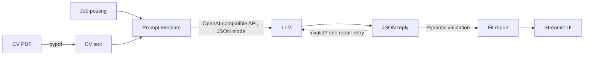

# JobFit AI

Compare your CV with a job posting using a large language model. Upload a CV (PDF), paste a job description, and get:

- **Match score** (0-100) with a short summary of the fit
- **Matched and missing skills** against the job's requirements
- **Strengths** to highlight and **concrete CV improvement tips**
- **Likely interview questions** for this specific role
- A **draft application email**, in Bahasa Indonesia or English

Built with Python, Streamlit, and any OpenAI-compatible LLM API (Groq, OpenRouter, OpenAI, 9router, or a local server).

## How it works



1. **Extract** the CV text from the PDF with `pypdf` and trim it to fit the model's context window.
2. **Prompt** the model with a recruiter-style system prompt that forbids inventing experience, and asks for one JSON object with fixed keys.
3. **Validate** the reply with Pydantic (`jobfit/schema.py`). Scores are rounded and clamped to 0-100, and JSON wrapped in prose or code fences is still recovered.
4. **Repair** once if validation fails: the model is shown its invalid reply and the error, and asked to correct it.
5. **Show** the report and the application email in the Streamlit UI.

## Project structure

```
app.py               Streamlit UI
jobfit/
  llm.py             OpenAI-compatible client, JSON mode, repair retry
  prompts.py         Prompt templates (analysis + application email)
  schema.py          Pydantic model and robust JSON extraction
  pdf.py             CV text extraction
tests/               Unit tests (schema, LLM logic with a fake client) and headless UI tests
```

## Run it locally

1. Get a free API key, for example from [Groq](https://console.groq.com/keys).
2. Set up the project:

   ```bash
   python -m venv .venv
   .venv\Scripts\activate          # macOS/Linux: source .venv/bin/activate
   pip install -r requirements.txt
   copy .env.example .env          # macOS/Linux: cp .env.example .env
   ```

3. Put your key in `.env` (`LLM_API_KEY=...`). To use another provider, change `LLM_BASE_URL` and `LLM_MODEL` (examples are in `.env.example`).
4. Start the app:

   ```bash
   streamlit run app.py
   ```

## Tests

```bash
pytest
```

The tests run without an API key: LLM calls are replaced by a fake client, and the UI is exercised headlessly with Streamlit's `AppTest`.

## Deploy

Push the repo to GitHub, create an app on [Streamlit Community Cloud](https://share.streamlit.io), and add `LLM_API_KEY` (plus `LLM_BASE_URL` / `LLM_MODEL` if needed) under **Settings → Secrets**.

## Privacy

The app stores nothing. Your CV and the job posting are only sent to the LLM provider you configure.

---

Made by [Hasan Mauladawillah](https://protofolio-hasan-9cbc.vercel.app) · [LinkedIn](https://www.linkedin.com/in/hasan-mauladawillah-51a703330/)
